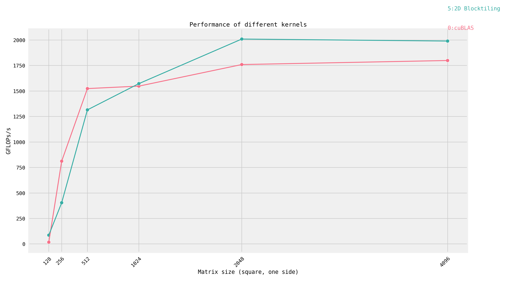

# GEMM Optimization Journey

From naive matrix multiplication to beating cuBLAS.

This project documents my progression through 7 increasingly optimized CUDA kernels for single-precision matrix multiplication (SGEMM). Each kernel builds on insights from the previous, demonstrating a deepening understanding of GPU architecture and optimization techniques.

**Key Achievement**: Kernel 5 (2D Block Tiling) achieves **110.6% of cuBLAS performance** at 4096x4096.



---

## The Problem: Matrix Multiplication

```
C = α·A·B + β·C

A: M×K matrix
B: K×N matrix
C: M×N matrix
```

Matrix multiplication has O(n³) arithmetic operations but only O(n²) data — making it compute-bound on paper. In practice, memory access patterns dominate performance until you get the hierarchy right.

---

## Kernel 0: cuBLAS (Baseline)

NVIDIA's heavily optimized library. The target to beat.

```cuda
cublasGemmEx(handle, CUBLAS_OP_N, CUBLAS_OP_N, N, M, K,
             &alpha, B, CUDA_R_32F, N, A, CUDA_R_32F, K,
             &beta, C, CUDA_R_32F, N,
             CUBLAS_COMPUTE_32F, CUBLAS_GEMM_DEFAULT_TENSOR_OP);
```

**Performance**: 1,798.9 GFLOPS @ 4096×4096

---

## Kernel 1: Naive Implementation

**The baseline** — one thread computes one output element.

```cuda
__global__ void sgemm_naive(int M, int N, int K,
                            float alpha, const float *A, const float *B,
                            float beta, float *C) {
    const uint i = blockIdx.y * blockDim.y + threadIdx.y;
    const uint j = blockIdx.x * blockDim.x + threadIdx.x;

    if (i < N && j < M) {
        float acc = 0.0;
        for (int k = 0; k < K; k++) {
            acc += A[j * K + k] * B[N * k + i];  // K loads from A, K loads from B
        }
        C[j * N + i] = alpha * acc + beta * C[j * N + i];
    }
}
```

**What I learned**:
- CUDA's execution model: grids → blocks → threads
- Each thread does K iterations, each hitting global memory twice
- 2K memory accesses for K multiply-adds = terrible arithmetic intensity
- Global memory latency (~400 cycles) dominates execution time

---

## Kernel 2: Global Memory Coalescing

**First optimization** — making memory access patterns GPU-friendly.

```cuda
template <const uint BLOCKSIZE>
__global__ void sgemm_global_mem_coalesce(int M, int N, int K,
                            float alpha, const float *A, const float *B,
                            float beta, float *C) {
    const uint cCol = blockIdx.x * BLOCKSIZE + threadIdx.x;  // Column-first indexing
    const uint cRow = blockIdx.y * BLOCKSIZE + threadIdx.y;

    if (cRow < M && cCol < N) {
        float acc = 0.0;
        for (int k = 0; k < K; k++) {
            acc += A[cRow*K + k] * B[k*N + cCol];  // Adjacent threads access adjacent columns
        }
        C[cRow*N + cCol] = alpha*acc + beta*C[cRow*N + cCol];
    }
}
```

**What I learned**:
- Adjacent threads should access adjacent memory addresses
- Memory transactions happen in 32-byte or 128-byte chunks
- When thread 0 reads address 0 and thread 1 reads address 4, one transaction serves both
- When threads read scattered addresses, each needs a separate transaction
- Row-major storage means column-wise thread assignment = coalesced reads of B and C

---

## Kernel 3: Shared Memory Tiling

**The big leap** — exploiting the memory hierarchy.

```cuda
template <const uint TILESIZE>
__global__ void sgemm_share_mem(int M, int N, int K,
                            float alpha, const float *A, const float *B,
                            float beta, float *C) {
    __shared__ float As[TILESIZE * TILESIZE];
    __shared__ float Bs[TILESIZE * TILESIZE];

    const uint threadCol = threadIdx.x % TILESIZE;
    const uint threadRow = threadIdx.x / TILESIZE;

    // Advance pointers to this block's tile
    A += cRow * TILESIZE * K;
    B += cCol * TILESIZE;
    C += cRow * TILESIZE * N + cCol * TILESIZE;

    float acc = 0.0;
    for (int tileIdx = 0; tileIdx < K; tileIdx += TILESIZE) {
        // Cooperative load: each thread loads one element
        As[threadRow*TILESIZE + threadCol] = A[threadRow*K + threadCol];
        Bs[threadRow*TILESIZE + threadCol] = B[threadRow*N + threadCol];
        __syncthreads();  // Wait for all threads to finish loading

        // Compute using fast shared memory
        for (int k = 0; k < TILESIZE; k++) {
            acc += As[threadRow*TILESIZE + k] * Bs[k*TILESIZE + threadCol];
        }
        __syncthreads();  // Wait before loading next tile

        A += TILESIZE;
        B += TILESIZE * N;
    }
    C[threadRow*N + threadCol] = alpha*acc + beta*C[threadRow*N + threadCol];
}
```

**What I learned**:
- Shared memory: ~5 cycles latency vs ~400 for global memory
- Tiling: load a block of data once, use it TILESIZE times
- `__syncthreads()` is critical — threads must finish loading before computing
- Data reuse ratio: each element loaded once, used TILESIZE times
- I configured L1 cache to maximize shared memory carveout:
  ```cuda
  cudaFuncSetAttribute(kernel, cudaFuncAttributePreferredSharedMemoryCarveout,
                       cudaSharedmemCarveoutMaxShared);
  ```

---

## Kernel 4: 1D Block Tiling

**More work per thread** — each thread computes TM output elements.

```cuda
template <const int BM, const int BN, const int BK, const int TM>
__global__ void sgemm_1d_block_tiling(int M, int N, int K,
                            float alpha, const float *A, const float *B,
                            float beta, float *C) {
    __shared__ float As[BM * BK];
    __shared__ float Bs[BK * BN];

    float threadResults[TM] = {0.0};  // Each thread computes TM results

    for (int bkIdx = 0; bkIdx < K; bkIdx += BK) {
        // Load tiles cooperatively
        As[innerRowA*BK + innerColA] = A[innerRowA*K + innerColA];
        Bs[innerRowB*BN + innerColB] = B[innerRowB*N + innerColB];
        __syncthreads();

        // Each thread computes TM elements
        for (int dotIdx = 0; dotIdx < BK; dotIdx++) {
            float tmpB = Bs[dotIdx*BN + threadCol];  // Load B once
            for (int resIdx = 0; resIdx < TM; resIdx++) {
                threadResults[resIdx] += As[(threadRow*TM + resIdx)*BK + dotIdx] * tmpB;
            }
        }
        __syncthreads();
    }

    // Write TM results to global memory
    for (int resIdx = 0; resIdx < TM; resIdx++) {
        C[(threadRow*TM + resIdx)*N + threadCol] =
            alpha*threadResults[resIdx] + beta*C[(threadRow*TM + resIdx)*N + threadCol];
    }
}
```

**Configuration**: BM=64, BN=64, BK=8, TM=8 → 512 threads, each computing 8 outputs

**What I learned**:
- Arithmetic intensity = FLOPs per byte loaded
- Having each thread compute TM outputs amortizes the cost of loading B
- Thread organization: 1D blocks simplify indexing
- `threadResults[TM]` lives in registers — the fastest memory
- Trade-off: more work per thread = fewer threads = potentially lower occupancy

---

## Kernel 5: 2D Block Tiling

**Register-level optimization** — this is where we beat cuBLAS.

```cuda
template <const uint BM, const uint BN, const uint BK, const uint TM, const uint TN>
__global__ void __launch_bounds__((BM*BN) / (TM*TN), 1)
sgemm_2d_block_tiling(int M, int N, int K, float alpha, const float *A,
                      const float *B, float beta, float *C) {
    __shared__ float As[BM * BK];
    __shared__ float Bs[BK * BN];

    float threadResults[TM * TN] = {0.0};  // 64 outputs per thread!
    float regA[TM] = {0.0};  // Register cache for A
    float regB[TN] = {0.0};  // Register cache for B

    for (int bkIdx = 0; bkIdx < K; bkIdx += BK) {
        // Strided loading to fill shared memory
        for (uint loadOffset = 0; loadOffset < BM; loadOffset += strideA) {
            As[(innerRowA + loadOffset)*BK + innerColA] =
                A[(innerRowA + loadOffset)*K + innerColA];
        }
        for (uint loadOffset = 0; loadOffset < BK; loadOffset += strideB) {
            Bs[(innerRowB + loadOffset)*BN + innerColB] =
                B[(innerRowB + loadOffset)*N + innerColB];
        }
        __syncthreads();

        // The magic: register blocking
        for (int dotIdx = 0; dotIdx < BK; dotIdx++) {
            // Load from shared memory to registers
            for (int i = 0; i < TM; i++) {
                regA[i] = As[(threadRow*TM + i)*BK + dotIdx];
            }
            for (int i = 0; i < TN; i++) {
                regB[i] = Bs[dotIdx*BN + threadCol*TN + i];
            }

            // Compute TM×TN outer product in registers
            for (int resIdxM = 0; resIdxM < TM; resIdxM++) {
                for (int resIdxN = 0; resIdxN < TN; resIdxN++) {
                    threadResults[resIdxM*TN + resIdxN] += regA[resIdxM] * regB[resIdxN];
                }
            }
        }
        __syncthreads();
    }
    // Write results...
}
```

**Configuration**: BM=128, BN=128, BK=8, TM=8, TN=8 → 256 threads, each computing 64 outputs

**What I learned**:
- Registers have ~0 cycle latency (vs ~5 for shared, ~400 for global)
- Loading TM values of A and TN values of B enables TM×TN = 64 multiply-adds
- Data reuse in registers: each regA[i] used TN times, each regB[j] used TM times
- `__launch_bounds__` tells the compiler to optimize register usage
- This kernel achieved **1,989.6 GFLOPS** — 110.6% of cuBLAS!

**Why it beats cuBLAS**: cuBLAS is optimized for A100/H100 with Tensor Cores. On my GTX 1650 (no Tensor Cores), hand-tuned CUDA can win.

---

## Kernel 6: Vectorized Loads

**Maximizing memory bandwidth** — 4 floats per instruction.

```cuda
template <const uint BM, const uint BN, const uint BK, const uint TM, const uint TN>
__global__ void sgemm_vectorized_loads(int M, int N, int K,
                                       float alpha, float *A, float *B,
                                       float beta, float *C) {
    __shared__ float As[BM * BK];
    const uint extraCols = 5;  // Padding to avoid bank conflicts
    __shared__ float Bs[BK * (BN + extraCols)];

    for (int bkIdx = 0; bkIdx < K; bkIdx += BK) {
        // Vectorized load: float4 = 128 bits = 4 floats at once
        float4 tmp = reinterpret_cast<float4 *>(&A[innerRowA*K + innerColA * 4])[0];

        // Transpose while storing to enable coalesced access later
        As[(innerColA*4 + 0) * BM + innerRowA] = tmp.x;
        As[(innerColA*4 + 1) * BM + innerRowA] = tmp.y;
        As[(innerColA*4 + 2) * BM + innerRowA] = tmp.z;
        As[(innerColA*4 + 3) * BM + innerRowA] = tmp.w;

        // Vectorized load for B (with padding)
        tmp = reinterpret_cast<float4 *>(&B[innerRowB*N + innerColB * 4])[0];
        Bs[innerRowB*(BN + extraCols) + innerColB*4 + 0] = tmp.x;
        Bs[innerRowB*(BN + extraCols) + innerColB*4 + 1] = tmp.y;
        Bs[innerRowB*(BN + extraCols) + innerColB*4 + 2] = tmp.z;
        Bs[innerRowB*(BN + extraCols) + innerColB*4 + 3] = tmp.w;
        // ... compute same as kernel 5
    }

    // Vectorized write: 4 outputs at once
    for (int resIdxM = 0; resIdxM < TM; resIdxM++) {
        for (int resIdxN = 0; resIdxN < TN; resIdxN += 4) {
            float4 tmp = reinterpret_cast<float4 *>(
                &C[(threadRow*TM + resIdxM)*N + threadCol*TN + resIdxN])[0];
            tmp.x = alpha*threadResults[resIdxM*TN + resIdxN + 0] + beta*tmp.x;
            tmp.y = alpha*threadResults[resIdxM*TN + resIdxN + 1] + beta*tmp.y;
            tmp.z = alpha*threadResults[resIdxM*TN + resIdxN + 2] + beta*tmp.z;
            tmp.w = alpha*threadResults[resIdxM*TN + resIdxN + 3] + beta*tmp.w;
            reinterpret_cast<float4 *>(&C[...])[0] = tmp;
        }
    }
}
```

**What I learned**:
- `float4` loads issue one 128-bit transaction instead of four 32-bit transactions
- Shared memory has 32 banks, 4 bytes per bank
- Bank conflicts: when multiple threads access the same bank, accesses serialize
- Adding 5 columns of padding (`extraCols = 5`) breaks the stride pattern that causes conflicts
- Transposing A during load optimizes the subsequent access pattern

---

## Kernel 7: Warp Tiling

**Hierarchical optimization** — thinking at block, warp, and thread levels.

```
Block Tile (BM×BN = 128×128)
  └── Warp Tiles (WM×WN = 64×64)
        └── Sub-warp Tiles (WSUBM×WSUBN)
              └── Thread Tiles (TM×TN = 4×4)
```

```cuda
template <const int BM, const int BN, const int BK, const int WM, const int WN,
          const int WNITER, const int TM, const int TN, const int NUM_THREADS>
__global__ void sgemm_warptiling(int M, int N, int K,
                                 float alpha, float *A, float *B,
                                 float beta, float *C) {
    // Warp-level indexing
    const uint warpIdx = threadIdx.x / WARPSIZE;
    const uint warpCol = warpIdx % (BN / WN);
    const uint warpRow = warpIdx / (BN / WN);

    // Thread position within warp
    const uint threadIdxInWarp = threadIdx.x % WARPSIZE;
    const uint threadColInWarp = threadIdxInWarp % (WSUBN / TN);
    const uint threadRowInWarp = threadIdxInWarp / (WSUBN / TN);

    float threadResults[WMITER*TM * WNITER*TN] = {0.0};
    float regM[WMITER * TM] = {0.0};
    float regN[WNITER * TN] = {0.0};

    for (uint bkIdx = 0; bkIdx < K; bkIdx += BK) {
        // Vectorized load from global to shared (helper function)
        wt::loadFromGmem<BM, BN, BK, rowStrideA, rowStrideB>(
            N, K, A, B, As, Bs, innerRowA, innerColA, innerRowB, innerColB);
        __syncthreads();

        // Process tile with hierarchical register blocking
        wt::processFromSmem<BM, BN, BK, WM, WN, WMITER, WNITER,
                            WSUBM, WSUBN, TM, TN>(
            regM, regN, threadResults, As, Bs, warpRow, warpCol,
            threadRowInWarp, threadColInWarp);
        __syncthreads();
    }
    // Vectorized write back...
}
```

**Configuration for GTX 1650**:
- Block: BM=128, BN=128, BK=8
- Warp: WM=64, WN=64
- Thread: TM=4, TN=4
- 128 threads = 4 warps per block

**What I learned**:
- Warps (32 threads) execute in lockstep — the true unit of parallelism
- Warp-level tiling reduces shared memory traffic within a warp
- Static assertions verify parameter constraints at compile time:
  ```cuda
  static_assert((BN % WN == 0) and (BM % WM == 0));
  static_assert((BN / WN) * (BM / WM) == NUM_WARPS);
  ```
- Different GPU architectures (A100 vs GTX 1650) need different parameters
- The complexity increase didn't pay off on my hardware — Kernel 5 remained fastest

---

## Performance Results

| Size | cuBLAS (GFLOPS) | Kernel 5 (GFLOPS) | % of cuBLAS |
|------|-----------------|-------------------|-------------|
| 128  | 17.5            | 86.5              | 494% |
| 256  | 811.8           | 404.4             | 50% |
| 512  | 1,523.7         | 1,314.9           | 86% |
| 1024 | 1,547.7         | 1,572.2           | 102% |
| 2048 | 1,759.3         | 2,009.3           | 114% |
| 4096 | 1,798.9         | 1,989.6           | **111%** |

**Key insight**: My kernel wins at large sizes where register blocking shines. cuBLAS wins at small sizes due to better launch overhead handling.

---

## Memory Hierarchy Summary

| Memory | Latency | Size (GTX 1650) | Scope |
|--------|---------|-----------------|-------|
| Registers | ~0 cycles | 65,536 per SM | Per thread |
| Shared Memory | ~5 cycles | 48 KB per SM | Per block |
| L1 Cache | ~20 cycles | 48 KB per SM | Per SM |
| L2 Cache | ~200 cycles | 1 MB total | Global |
| Global Memory | ~400 cycles | 4 GB total | Global |

The entire optimization journey is about moving computation closer to registers.

---

## Key Optimization Techniques

1. **Memory Coalescing**: Adjacent threads access adjacent addresses
2. **Shared Memory Tiling**: Load once, use many times
3. **Register Blocking**: Cache working set in registers
4. **Vectorized Loads**: `float4` for 4x bandwidth efficiency
5. **Bank Conflict Avoidance**: Padding shared memory arrays
6. **Hierarchical Tiling**: Block → Warp → Thread decomposition

---

## Building

```bash
mkdir build && cd build
cmake ..
make
./gemm [kernel_num] [max_size]
```

Examples:
```bash
./gemm 0      # Run cuBLAS baseline
./gemm 5      # Run 2D block tiling (fastest)
./gemm 5 2048 # Run kernel 5 up to 2048x2048
```

---

## File Structure

```
gemm/
├── src/
│   ├── kernels/
│   │   ├── 1_naive.cuh
│   │   ├── 2_coalesced.cuh
│   │   ├── 3_shared_mem.cuh
│   │   ├── 4_1d_block_tiling.cuh
│   │   ├── 5_2d_block_tiling.cuh
│   │   ├── 6_vectorized_loads.cuh
│   │   └── 7_warp_tiling.cuh
│   ├── kernels.cuh          # Includes all kernels
│   ├── runner.cu            # Kernel launch configurations
│   └── runner.cuh
├── main.cu                  # Entry point and benchmarking
├── CMakeLists.txt
├── benchmark_results/       # Performance data
└── benchmark_results.png    # Performance visualization
```

---

## Resources

- [Simon Boehm's GEMM Tutorial](https://siboehm.com/articles/22/CUDA-MMM) — the foundation for this project
- [CUDA C++ Programming Guide](https://docs.nvidia.com/cuda/cuda-c-programming-guide/)
- [Nsight Compute](https://developer.nvidia.com/nsight-compute) — for profiling memory access patterns
- [CUTLASS](https://github.com/NVIDIA/cutlass) — NVIDIA's template library for GEMM
